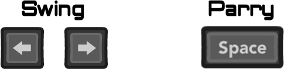
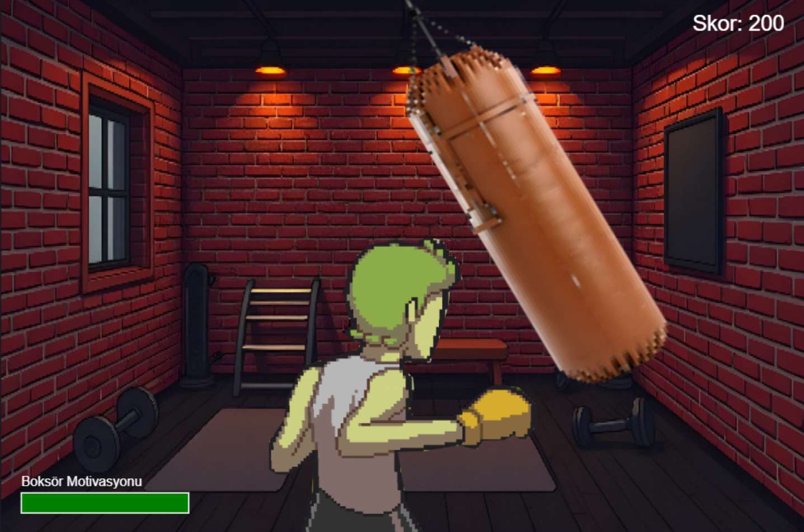
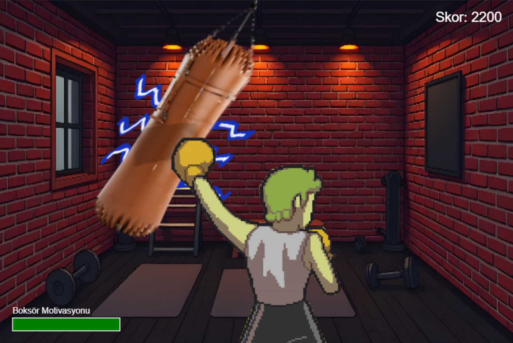

# Teach Me! Mr. Punching Bag

https://makhsudov.github.io/WTP_Proje1/
Deneyimli ve bilge bir boks torbası olarak, acemi bir boksörü eğitmeye hazır mısın? Yeni başlayan boksörün henüz yumruk atmayı bilmiyor, bu yüzden deneyimi eğlenceli hale getirmen gerekiyor!

## 🎮 Oyun Hakkında

Bu oyunda siz deneyimli bir boks torbasısınız ve genç bir boksörü eğitiyorsunuz. Boksörün yumruklarını yakalamak için sallanmanız gerekiyor, ancak çok fazla vuruş kaçırırsanız boksörün motivasyonu düşer ve antrenman sona erer!

## 🥊 Nasıl Oynanır

**Kontroller:**
- **Sol-Sağ Ok Tuşları:** Salllanmak için
- **Space Tuşu:** Savunma yapmak ve yavaşlamak için

*Oyun kontrolleri*

**Amaç:** Boksörün yumruklarını yakalamak ve motivasyonunu yüksek tutmak!

## 👉 Oyun Özellikleri

- Eğlenceli ve benzersiz oynanış mekaniği
- Gerçekçi fizik simülasyonu
- Artan zorluk seviyesi
- Motivasyon sistemi
- Retro pixel art stili

## 🖼️ Oyun İçi Görüntüler

## 🎥 Oynanış Videosu

[Oynanış Videosu](https://youtu.be/ZT-h6K26Bzc)

## 🎯 Oyun Mekaniği

Oyuncu bir boks torbası olarak:
- Boksörün yumruklarını yakalamaya çalışır
- Çok fazla vuruş kaçırırsa boksörün motivasyonu düşer
- Space tuşu ile savunma yapabilir ve tempo kontrol edebilir
- Başarılı yakalamalar puan kazandırır

## 📚 Kaynaklar ve Referanslar

### İlham Alınan Oyun:
**Teach Me! Mr. Punching Bag:** [https://salut-c-leo.itch.io/mr-punching-bag]

### Kullanılan Asset'ler:
- **Karakter Sprite'ları:** [Kaynak linki (itch.io)](https://salut-c-leo.itch.io/mr-punching-bag)
- **Background Resmi:** [Kaynak linki (deepai.org)](https://deepai.org/machine-learning-model/text2img)
- **Ses Efektleri:** [Kaynak linki (pixabay.com)](https://pixabay.com/)
- **Boksörün sesi:** [Kaynak linki (narekeet.com)](http://narakeet.com/languages/text-to-speech-turkish/)

